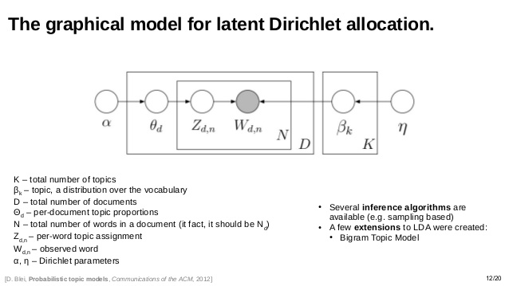
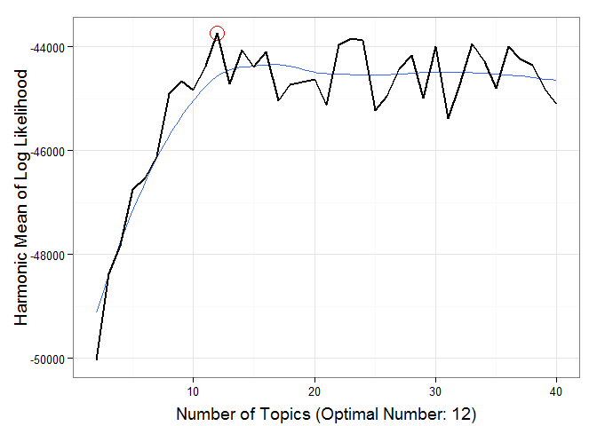

Topic Models Learning and R Resources
============

This is a collection documenting the resources I find related to topic
models with an R flavored focus. A *topic model* is a type of
[*generative*](https://en.wikipedia.org/wiki/Generative_model) model
used to "discover" latent topics that compose a *corpus* or collection
of documents. Typically topic modeling is used on a collection of text
documents but can be used for other modes including use a caption
generation for images.

Table of Contents
============

-   [Key Players](#key-players)
-   [Videos](#videos)
    -   [Introductory](#introductory)
    -   [Theory](#theory)
    -   [Visualization](#visualization)
-   [Articles](#articles)
    -   [Applied](#applied)
    -   [Theoretical](#theoretical)
-   [Websites & Blogs](#websites--blogs)
-   [R Resources](#r-resources)
    -   [Package Comparisons](#package-comparisons)
    -   [References](#references)
    -   [Example Modeling](#example-modeling)
-   [Topic Modeling R Demo](#topic-modeling-r-demo)
    -   [topicmodels Package](#topicmodels-package)
-   [Contributing](#contributing)

Key Players
============

Papadimitriou, Raghavan, Tamaki & Vempala, Santosh (1997) first
introduced the notion of topic modeling in their ["Latent Semantic
Indexing: A probabilistic analysis"](/articles/Papadimitriou1997.pdf).
Thomas Hofmann (1999) developed "Probabilistic latent semantic
indexing". Blei, Ng, & Jordan (2003) proposed *latent Dirichlet
allocation* (LDA) as a means of modeling documents with multiple topics
but assumes the topic are uncorrelated. Blei & Lafferty (2007) proposed
*correlated topics model* (CTM), extending LDA to allow for correlations
between topics. Roberts, Stewart, Tingley, & Airoldi (2013) propose a
[*Structural Topic Model*](/articles/Roberts2013.pdf) (STM), allowing
the inclusion of meta-data in the modeling process.

Videos
======

Introductory
------------

-   Boyd-Graber, J. (2013). [Computational Linguistics I: Topic
    Modeling](https://www.youtube.com/watch?v=4p9MSJy761Y)

-   Jordan, M. (2014) [A Short History of Topic
    Models](https://www.youtube.com/watch?v=fBNsHPtTAGs)

Theory
------

-   Blei, D. (2007) [Modeling Science: Dynamic Topic Models of Scholarly
    Research](https://www.youtube.com/watch?v=7BMsuyBPx90)

-   Blei, D. (2009) [Topic Models: Parts I &
    II](http://videolectures.net/mlss09uk_blei_tm/#) ([Lecture
    Notes](/presentations/Blei2009.pdf))

Visualization
-------------

-   Sievert, C. (2014) [LDAvis: A method for visualizing and
    interpreting topic
    models](https://www.youtube.com/watch?v=IksL96ls4o0)

-   Maybe, B. (2015) [SavvySharpa: Visualizing Topic
    Models](https://www.youtube.com/watch?v=tGxW2BzC_DU)

Articles
========

Applied
-------

Newman, D.J. & Block, S. (2006). [Probabilistic topic decomposition of
an eighteenth-century American newspaper](/articles/Newman2006.pdf).
*Journal of the American Society for Information Science and Technology.
57*(6), 753-767. <doi:10.1002/asi.v57:6>

Theoretical
-----------

-   Blei, D. M. (2012). [Probabilistic topic
    models](/articles/Blei2012.pdf). *Communications of the ACM, (55)*4,
    77-84. <doi:10.1145/2133806.2133826>

-   Blei, D. M. & Lafferty, J. D. (2007) [A correlated topic model of
    Science](/articles/Blei2007.pdf). *The Annals of Applied Statistics
    1*(1), 17-35. <doi:10.1214/07-AOAS114>

-   Blei, D. M. & Lafferty, J. D. (2009) [Topic
    models](/articles/Blei2009.pdf). In A Srivastava, M Sahami (eds.),
    [*Text mining: classification, clustering, and
    applications*](/articles/Srivastava2009.pdf). Chapman & Hall/CRC
    Press. 71-93.

-   Blei, D. M. & McAuliffe, J. (2008). [Supervised topic
    models](/articles/Blei2008.pdf). In Advances in Neural Information
    Processing Systems 20, 1-8.

-   Blei, D. M., Ng, A.Y., & Jordan, M.I. (2003). [Latent Dirichlet
    Allocation](/articles/Blei2003.pdf). *Journal of Machine Learning
    Research, 3*, 993-1022.

-   Chang, J., Boyd-Graber, J. , Wang, C., Gerrish, S., & Blei. D.
    (2009). [Reading tea leaves: How humans interpret topic
    models](/articles/Chang2009.pdf). In *Neural Information Processing
    Systems*.

-   Griffiths, T.L. & Steyvers, M. (2004). [Finding Scientific
    Topics](/articles/Griffiths2004.pdf). Proceedings of the National
    Academy of Sciences of the United States of America, 101, 5228-5235.

-   Griffiths, T.L., Steyvers, M., & Tenenbaum, J.B.T. (2007). [Topics
    in Semantic Representation](/articles/Griffiths2007.pdf).
    *Psychological Review, 114*(2), 211-244.

-   Grüen, B. & Hornik, K. (2011). [topicmodels: An R Package for
    Fitting Topic Models. Journal of Statistical
    Software](/articles/Gruen2011.pdf), 40(13), 1-30.

-   Roberts M.E., Stewart B.M., Tingley D., & Airoldi E.M. (2013) [The
    Structural Topic Model and Applied Social
    Science](/articles/Roberts2013.pdf). *Advances in Neural Information
    Processing Systems Workshop on Topic Models: Computation,
    Application, and Evaluation*, 1-4.

-   Roberts, M., Stewart, B., Tingley, D., Lucas, C., Leder-Luis, J.,
    Gadarian, S., Albertson, B., et al. (2014). [Structural topic models
    for open ended survey responses](/articles/Roberts2014.pdf).
    *American Journal of Political Science, American Journal of
    Political Science, 58*(4), 1064-1082.

-   Roberts, M., Stewart, B., Tingley, D. (n.d.). [stm: R Package for
    Structural Topic Models](/articles/Robertsnd.pdf), 1-49.

-   Sievert, C. & Shirley, K. E.. (2014). [LDAvis: A Method for
    Visualizing and Interpreting Topics.](/articles/Robertsnd.pdf)
    *Proceedings of the Workshop on Interactive Language Learning,
    Visualization, and Interfaces*, 63-70.

-   Steyvers, M. & Griffiths, T. (2007). [Probabilistic topic
    models](/articles/Steyvers2007.pdf). In T. Landauer, D McNamara, S.
    Dennis, and W. Kintsch (eds), *Latent Semantic Analysis: A Road to
    Meaning*. Laurence Erlbaum

-   Taddy, M.A. (2012). [On Estimation and Selection for Topic
    Models](/articles/Taddy2012.pdf) In *Proceedings of the 15th
    International Conference on Artificial Intelligence and Statistics
    (AISTATS 2012)*, 1184-1193.

Websites & Blogs
================

-   Blei, D. (n.d.). [David Blei on Topic
    Models](https://www.cs.princeton.edu/~blei/topicmodeling.html)

-   Jockers, M.L. (2013). ["Secret" Recipe for Topic Modeling
    Themes](http://www.matthewjockers.net/2013/04/12/secret-recipe-for-topic-modeling-themes/)

-   Schmidt, B.M. (2012) [Words Alone: Dismantling Topic Models in the
    Humanities](http://journalofdigitalhumanities.org/2-1/words-alone-by-benjamin-m-schmidt/)

-   Weingart, S. (2012). [Topic Modeling for Humanists: A Guided
    Tour](http://www.scottbot.net/HIAL/?p=19113)

-   Jones, T. (n.d.) [Topic Models Reading
    List](http://www.biasedestimates.com/p/topic-models-reading-list.html)

R Resources
===========

Package Comparisons
-------------------

<table>
<thead>
<tr class="header">
<th align="left">Package</th>
<th align="left">Functionality</th>
<th align="left">Pluses</th>
<th align="left">Author</th>
<th align="left">R Language Interface</th>
</tr>
</thead>
<tbody>
<tr class="odd">
<td align="left">lda*</td>
<td align="left">Collapsed Gibbs for LDA</td>
<td align="left">Graphing utilities</td>
<td align="left">Chang</td>
<td align="left">R</td>
</tr>
<tr class="even">
<td align="left">topicmodels</td>
<td align="left">LDA and CTM</td>
<td align="left">Follows Blei's implementation; great vignette; takes</td>
<td align="left">C</td>
<td align="left"><a href="https://en.wikipedia.org/wiki/Document-term_matrix">DTM</a></td>
</tr>
<tr class="odd">
<td align="left">stm</td>
<td align="left">Model w/ meta-data</td>
<td align="left">Great documentation; nice visualization</td>
<td align="left">Roberts, Stewart, &amp; Tingley</td>
<td align="left">C</td>
</tr>
<tr class="even">
<td align="left">LDAvis</td>
<td align="left">Interactive visualization</td>
<td align="left">Aids in model interpretation</td>
<td align="left">Sievert &amp; Shirley</td>
<td align="left">R + Shiny</td>
</tr>
<tr class="odd">
<td align="left">mallet**</td>
<td align="left">LDA</td>
<td align="left"><a href="http://programminghistorian.org/lessons/topic-modeling-and-mallet">MALLET</a> is well known</td>
<td align="left">Mimno</td>
<td align="left">Java</td>
</tr>
</tbody>
</table>

\*[*StackExchange discussion of lda vs.
topicmodels*](http://stats.stackexchange.com/questions/24441/two-r-packages-for-topic-modeling-lda-and-topicmodels)  
\*\*[*Setting Up
MALLET*](http://programminghistorian.org/lessons/topic-modeling-and-mallet)

References
----------

-   Chang J. (2010). lda: Collapsed Gibbs Sampling Methods for Topic
    Models. <http://CRAN.R-project.org/package=lda>.

-   Grüen, B. & Hornik, K. (2011). [topicmodels: An R Package for
    Fitting Topic Models. Journal of Statistical
    Software](/articles/Gruen2011.pdf), 40(13), 1-30.

-   Mimno, D. (2013). [vignette-mallet: A wrapper around the Java
    machine learning tool MALLET](/articles/Mimno2013.Rmd).
    <https://CRAN.R-project.org/package=mallet>

-   Roberts, M., Stewart, B., Tingley, D. (n.d.). [stm: R Package for
    Structural Topic Models](/articles/Robertsnd.pdf), 1-49.

-   Sievert, C. & Shirley, K. E.. (2014a). [LDAvis: A Method for
    Visualizing and Interpreting Topics.](Sievert2014a.pdf) *Proceedings
    of the Workshop on Interactive Language Learning, Visualization, and
    Interfaces* 63-70.

-   Sievert, C. & Shirley, K. E.. (2014b). [Vignette: LDAvis
    details.](/articles/Sievert2014b.pdf) 1-5.

Example Modeling
----------------

-   Awati, K. (2015). [A gentle introduction to topic modeling using
    R](https://eight2late.wordpress.com/2015/09/29/a-gentle-introduction-to-topic-modeling-using-r/)

-   Dubins, M. (2013). [Topic Modeling in Python and R: A Rather Nosy
    Analysis of the Enron Email
    Corpus](https://dzone.com/articles/topic-modeling-python-and-r)

-   Goodrich, B. (2015) [Topic Modeling Twitter Using
    R](https://www.linkedin.com/pulse/topic-modeling-twitter-using-r-bryan-goodrich)
    [(CODE)](https://gist.githubusercontent.com/bryangoodrich/7b5ef683ce8db592669e/raw/3402e7390d10a0282dc0d6309ed4df9a4fb1cf5d/TwitterTopics.r)

-   inkhorn82 (2014). [A Delicious Analysis! (aka topic modelling using
    recipes)](http://rforwork.info/2014/02/17/a-delicious-analysis/)
    [(CODE)](https://gist.githubusercontent.com/inkhorn/9044779/raw/c7f0ba30d424aaeb75c5e221d12566f6732c4f29/recipe%20analysis.R)

-   Jockers, M.L. (2014).[Introduction to Text Analysis and Topic
    Modeling with
    R](http://www.matthewjockers.net/materials/dh-2014-introduction-to-text-analysis-and-topic-modeling-with-r/)

-   Medina, L. (2015). [Conspiracy Theories – Topic Modeling & Keyword
    Extraction](http://voidpatterns.org/2015/03/conspiracy-theories-topic-modeling-keyword-extraction/)

-   Sievert, C. (n.d.). [A topic model for movie
    reviews](http://cpsievert.github.io/LDAvis/reviews/reviews.html)

Topic Modeling R Demo
=====================

topicmodels Package
-------------------

The .R script for this demonstration can be downloaded from
[scripts/Example\_topic\_model\_analysis.R](https://raw.githubusercontent.com/trinker/topicmodels_learning/master/scripts/Example_topic_model_analysis.R)

### Install/Load Tools & Data

    if (!require("pacman")) install.packages("pacman")
    pacman::p_load_gh("trinker/gofastr")
    pacman::p_load(tm, topicmodels, dplyr, tidyr,  devtools, LDAvis, ggplot2)

    ## Source topicmodels2LDAvis function
    devtools::source_url("https://gist.githubusercontent.com/trinker/477d7ae65ff6ca73cace/raw/79dbc9d64b17c3c8befde2436fdeb8ec2124b07b/topicmodels2LDAvis")

    ## SHA-1 hash of file is f9a066b61c9f992daff3991a3293e18897268598

    data(presidential_debates_2012)

### Generate Stopwords

    stops <- c(
            tm::stopwords("english"),
            "governor", "president", "mister", "obama","romney"
        ) %>%
        gofastr::prep_stopwords() 

### Create the DocumentTermMatrix

    doc_term_mat <- presidential_debates_2012 %>%
        with(gofastr::q_dtm_stem(dialogue, paste(person, time, sep = "_"))) %>%           
        gofastr::remove_stopwords(stops) %>%                                                    
        gofastr::filter_tf_idf() %>%
        gofastr::filter_documents() 

### Run the Model

    lda_model <- topicmodels::LDA(doc_term_mat, 10, control = list(seed=100))

### Plot the Topics Per Person & Time

    topics <- topicmodels::posterior(lda_model, doc_term_mat)[["topics"]]
    topic_dat <- dplyr::add_rownames(as.data.frame(topics), "Person_Time")
    colnames(topic_dat)[-1] <- apply(terms(lda_model, 10), 2, paste, collapse = ", ")

    tidyr::gather(topic_dat, Topic, Proportion, -c(Person_Time)) %>%
        tidyr::separate(Person_Time, c("Person", "Time"), sep = "_") %>%
        dplyr::mutate(Person = factor(Person, 
            levels = c("OBAMA", "ROMNEY", "LEHRER", "SCHIEFFER", "CROWLEY", "QUESTION" ))
        ) %>%
        ggplot2::ggplot(ggplot2::aes(weight=Proportion, x=Topic, fill=Topic)) +
            ggplot2::geom_bar() +
            ggplot2::coord_flip() +
            ggplot2::facet_grid(Person~Time) +
            ggplot2::guides(fill=FALSE) +
            ggplot2::xlab("Proportion")

### LDAvis of Model

The output from **LDAvis** is not easily embedded within an R markdown
document, however, the reader may [see the results
here](http://trinker.github.io/LDAvis/example/).

    lda_model %>%
        topicmodels2LDAvis() %>%
        LDAvis::serVis()

Contributing
============

You are welcome to: 
* submit suggestions and bug-reports at: <https://github.com/trinker/topicmodels_learning/issues> 
* send a pull request on: <https://github.com/trinker/topicmodels_learning/> 
* compose a friendly e-mail to: <tyler.rinker@gmail.com>
